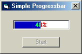



## Simple Progressbar

### Description

I've seen a lot of progress bar code on this site, but I haven't seen any that show you how to set up the caption so it will change color as the bar moves over it.

This is a very basic example of how to do that. The trick is setting the DrawMode to "Not Xor Pen"; you can also use "Merge Pen Not".

This example is only to get you started. You'll have to play around with the BackColor, ForeColor and RGB color used for the bar to get the color effect you want.

Have fun.
 
### More Info
 

             |
---                |---
**Submitted On**   |2001-04-05 13:28:26
**By**             |[Glenn C\.](https://github.com/Planet-Source-Code/PSCIndex/blob/master/ByAuthor/glenn-c.md)
**Level**          |Beginner
**User Rating**    |4.3 (13 globes from 3 users)
**Compatibility**  |VB 5\.0, VB 6\.0
**Category**       |[Custom Controls/ Forms/  Menus](https://github.com/Planet-Source-Code/PSCIndex/blob/master/ByCategory/custom-controls-forms-menus__1-4.md)
**World**          |[Visual Basic](https://github.com/Planet-Source-Code/PSCIndex/blob/master/ByWorld/visual-basic.md)
**Archive File**   |[Simple Pro17962452001\.zip](https://github.com/Planet-Source-Code/glenn-c-simple-progressbar__1-22162/archive/master.zip)

